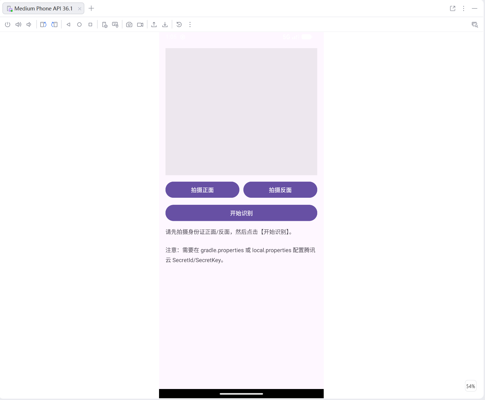

# ScanIDCardTencentV3
**身份证识别实验：腾讯云 OCR + V3（TC3-HMAC-SHA256）签名**

本项目严格按照以下的流程实现：  
**拍照 → 保存图片 → Base64 → V3(TC3)签名 → POST 请求 → Handler 解析 JSON → 展示结果**

---

## 预览

---

## 功能
- 📷 拍摄身份证**正面/反面**
- 🧾 图片压缩并转 Base64
- 🔐 使用腾讯云 API **V3（TC3-HMAC-SHA256）签名**鉴权
- 🌐 调用腾讯云 OCR 接口 `IDCardOCR`
- 🧩 解析 JSON 并显示关键字段（姓名、身份证号、签发机关、有效期等）

---

## 环境要求
- Android Studio（建议 Jellyfish / Koala 及以上）
- JDK 17（Android Studio 自带即可）
- 真机（推荐）或模拟器（需要相机能力）

---

## 配置腾讯云密钥（必须）
出于安全原因，本项目不会内置你的 `SecretId/SecretKey`，需要你本地配置。

### 方式 A（推荐）：local.properties
1. 将根目录 `local.properties.example` 复制为 `local.properties`
2. 在 `local.properties` 末尾添加（不要加引号）：

```properties
TENCENT_SECRET_ID=你的SecretId
TENCENT_SECRET_KEY=你的SecretKey
